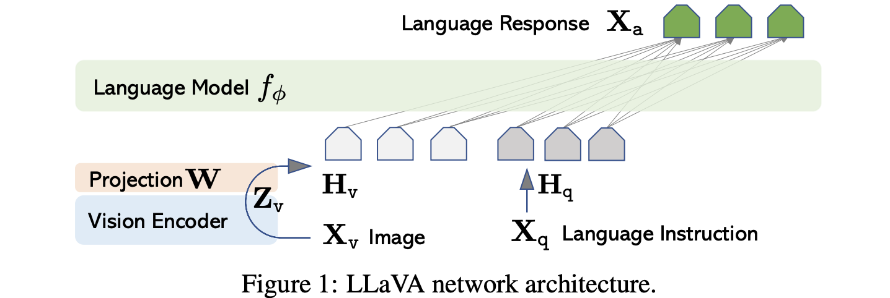

# 持续整理中，codebase源自于原仓库[LLaVA](https://github.com/haotian-liu/LLaVA)
# llava_finetune
一个用于llava-v1.5-7b和llava-v1.6-mistral-7b微调的仓库，理解llava模型设计细节

# 模型结构设计
llava更新了三个版本v1、v1.5、v1.6。整体结构为使用vit作为vison-encoder，权重初始化自clip，使用预训练的llama作为text decoder，中间设置一个adapter，将vison token对齐到text token的embedding向量空间。  
在vison token featuer 前后增加特殊的图片开始和结束标志位，和text token完成特征拼接。
llava的优势在于，使用的训练数据极少，完整的训练时间非常短，8A100一天完成训练

<div align="center">
  
  <p style="font-size: 10px; color: gray;">llava arch</p>
</div>

> **llava-v1**的adapter设置为一个简单的投影矩阵（单linear层）完成对齐，输入图像分辨率为224。训练包括两个阶段，全程冻结vison encoder，第一阶段只训练adapter，完成模态对齐。第二阶段训练adaper和llm，完成指令微调。

> **llava-1.5**的adaptr设置为一个两层的MLP层完成对齐，vison encoder使用更大的clip vit模型，输入图像分辨率为336，同时prompt中设定短答案输出的格式，提高短输出benchmark的准确度


<div align="center">
  
  <p style="font-size: 10px; color: gray;">llava-1.6 patch process</p>
</div>

> **llava-1.6**从源码看来，是对论文中llava-1.5=HD的实现。使用224分辨力的clip作为vision encoder。对高分辨率的图片resize并padding到预设高分辨率，将图片等分为四个区域加上一张原始resize图片(224的分辨率)，分布进行encoder后完成拼接，得到token featuer


## 微调
具备clip和transformer库的基础，对llava的代码比较容易理解，主要使用了transformer库的封装。  
同时，为了方便快速理解微调原理，在每个微调方法上，会简要说明方法原理，并说明需要注意的细节。

### 01 deepspeed + transformer的分布式训练
transformer库的训练器和模型框架原生支持deepseed的分布式训练。这里只需要理解deepseed的分片策略，设置相应的配置文件即可快速进行大模型的训练。分片策略层级越高，显存节省越大，但通信时间越大，简单介绍如下  

```python
"""
    层级    分片对象                            显存占用分析(同精度 完全分片 N GPU)
    zero 1 优化器状态（adam的动量和方差参数）      60% + 40% / N
    zero 2 优化器状态 + 梯度                    40% + 60% / N
    zero 3 优化器状态 + 梯度 + 模型参数          20% + 80% / N

显存占用对象: 优化器 (Adam 一阶动量与二阶动量)、模型梯度、模型参数
显存占用量化:
    梯度: 模型梯度参数量约等于模型参数量
    优化器: Adam存储一阶动量和二阶动量，合计参数量是模型参数的两倍
    激活值: 模型前向传播的中间计算结果，用于反向传播计算参数梯度，transformer通常占10%-30%
           显存计算公式: Batch Size × Sequence Length × Hidden Size × 层数 × 精度字节数

    进一步需要考虑数值精度的类型，同样数值类型下，显存占用比例等于参数量比例
    举例：7B模型float16 + 完全训练需要显存: 7G * 2(bit位) * (4(份) + 1(激活)) = 70G
    2bit位表示一个float16浮点数存储占2个字节，4份表示模型参数、梯度和优化器
"""
```

使用方法: 见```tain_deepseed.py```
* 将分片策略参数定义在zero.json文件
* 启动训练命令

### 02 peft实现loar微调
lora微调是大模型最常用的微调手段，本质是对linear层进行调整，但不直接对linear层进行训练，而是使用类似残差连接并控制训练参数自由度的方式进行训练，基本公式为如下

<div align="center">
  
  <p style="font-size: 10px; color: gray;">lora fuc</p>
</div>

linear层参数是一个shape为(in_feature, out_feature)的参数矩阵(先不考虑bias)，表示为W0。A和B是一个低秩矩阵，A的shape为(in_feature, r)，B的shape为(r, out_feature)。


α
α是lora_alpha，用于缩放低秩矩阵的增量。
r 是低秩矩阵的秩。

### 03 peft实现低bit微调
低bit量化


### 04 fsdp训练: 模型分片，模型保存

* ddp: 数据并行， 模型、梯度、优化器状态在同一个gpu上，优化器状态分布在主节点更新同步套所有节点。特点速度更快 但单卡峰值的显存依赖更大

* fsdp: 将模型、梯度、优化器进行分片(gups个unit，每个unit含有模型、梯度、优化器的一个module的一个片段)
    - 举例将一个module参数等分为gpus个分片分布在每个fsdpunit中
    - forward fsdp unit 从其他rank中获取层的其他参数，恢复完整后每forward，结果传递给下一个unit
    - backward fsdp unit 从其他rank中获取层的其他参数，恢复完整后每forward，梯度分片保存，梯度函数传递给上一个unit
    - 特点：速度慢一些，但是单卡峰值显存依赖小
    - 当前后分片为多进程的方式工作，即上一节点不用完全等待下一节点处理完，此时可以实现模型(分片)并行的效果
    - * 详细讲解：http://shiyanjun.cn/archives/2292.html
    - * 官方教程：https://pytorch.org/tutorials/intermediate/FSDP_tutorial.html#how-to-use-fsdp

### 05 accelerate分布式训练加速


