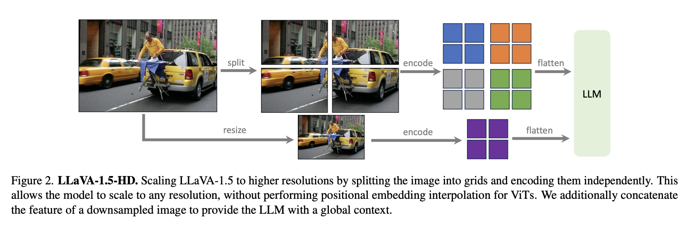
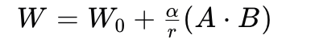

# llava_finetune
一个用于llava-v1.5-7b和llava-v1.6-mistral-7b微调的仓库，理解llava模型设计细节

# 模型结构设计
llava更新了三个版本v1、v1.5、v1.6。整体结构为使用vit作为vison-encoder，权重初始化自clip，使用预训练的llama作为text decoder，中间设置一个adapter，将vison token对齐到text token的embedding向量空间。 

在vison token featuer 前后增加特殊的图片开始和结束标志位，和text token完成特征拼接。

**llava的优势在于，使用的训练数据极少，完整的训练时间非常短，8×A100一天完成训练**

<div align="center">
  
  <p style="font-size: 10px; color: gray;">llava arch</p>
</div>

> **llava-v1**
> * adapter设置为一个简单的投影矩阵（单linear层）完成对齐，输入图像分辨率为224。
> * 训练包括两个阶段，全程冻结vison encoder，第一阶段只训练adapter，完成模态对齐。第二阶段训练adaper和llm，完成指令微调。

> **llava-1.5**
> * adaptr设置为一个两层的MLP层完成对齐，vison encoder使用更大的clip vit模型，输入图像分辨率为336
> * 同时prompt中设定短答案输出的格式，提高短输出benchmark的准确度


<div align="center">
  
  <p style="font-size: 10px; color: gray;">llava-1.6 patch process</p>
</div>

> **llava-1.6**
> * 从源码看来，是对论文中llava-1.5-HD的实现。使用224分辨力的clip作为vision encoder。
> * 对高分辨率的图片resize并padding到预设高分辨率，将图片等分为四个区域加上一张原始resize图片(224的分辨率)，分别进行encoder后完成拼接，得到vison token

## 微调
具备clip和transformer库的基础，对llava的代码比较容易理解，主要使用了transformer库的封装。  

同时，为了方便快速理解微调原理，在每个微调方法上，会简要说明方法原理，并说明需要注意的细节。

codebase源自于原仓库[LLaVA](https://github.com/haotian-liu/LLaVA)

### 01 deepspeed + transformer的分布式训练
transformer库的训练器和模型框架原生支持deepseed的分布式训练。这里只需要理解deepseed的分片策略，设置相应的配置文件即可快速进行大模型的训练。分片策略层级越高，显存节省越大，但通信时间越长，简单介绍如下  

```python
"""
    层级    分片对象                            显存占用分析(同精度 完全分片 N GPU)
    zero 1 优化器状态（adam的动量和方差参数）      60% + 40% / N
    zero 2 优化器状态 + 梯度                    40% + 60% / N
    zero 3 优化器状态 + 梯度 + 模型参数          20% + 80% / N

显存占用对象: 优化器 (Adam 一阶动量与二阶动量)、模型梯度、模型参数
显存占用量化:
    梯度: 模型梯度参数量约等于模型参数量
    优化器: Adam存储一阶动量和二阶动量，合计参数量是模型参数的两倍
    激活值: 模型前向传播的中间计算结果，用于反向传播计算参数梯度，transformer通常占10%-30%
           显存计算公式: Batch Size × Sequence Length × Hidden Size × 层数 × 精度字节数

    进一步需要考虑数值精度的类型，同样数值类型下，显存占用比例等于参数量比例
    举例：7B模型float16 + 完全训练需要显存: 7G * 2(字节位) * (4(份) + 1(激活)) = 70G
    2字节位表示一个float16浮点数存储占2个字节，4份表示模型参数、梯度和优化器
"""
```

训练脚本见```train_deepseed.py```
* 将分片策略参数定义在zero.json文件
* 启动训练命令```cd llava_finetune/ | bash script/train_deepspeed_script.sh```

### 02 peft实现loar微调
lora微调是大模型最常用的微调手段，本质是对linear层进行调整，但不直接对其进行训练，而是使用类似残差连接并控制训练参数自由度的方式进行训练，基本公式为如下

<div align="center">
  
</div>

* linear层参数是一个shape为(in_feature, out_feature)的参数矩阵(先不考虑bias)，表示为W0。
* A是shape为(in_feature, r)的矩阵，B是shape为(r, out_feature)的矩阵。设定r远小于out_feature，A和B为低秩矩阵，r越大，AB的参数的自由度越高。
* α是lora_alpha，用于缩放低秩矩阵的增量，平衡每一次参数更新对原参数W0的影响
* "+"的方式类似残差连接的结构，保证原始模型效果不退化太大

基于上述可以知道lora微调首先需要指定哪些linear层，然后设定r和α超参数，最后直接调用peft进行微调即可  
训练脚本见```train_lora_single.py```

```python
# train lora config
if training_args.lora_enable:
    from train.utils import find_all_linear_names   # 自定义微调linear层
    target_modules = find_all_linear_names(model)    
    peft_config = LoraConfig(
        r=training_args.lora_r,                     # r
        lora_alpha=training_args.lora_alpha,        # α
        lora_dropout=training_args.lora_dropout,    # 对AB进行随机dropout比例
        bias=training_args.lora_bias,               # A和B对应的linear层是否设置对应的bias
        target_modules=target_modules
    )
    model = get_peft_model(model, peft_config)      
```

最后，只需要搞清楚lora微调的模型如何进行保存与加载
> 训练过程只需要保存lora层和非冻结层参数权重，见save_peft_lora_model函数
> 加载预训练模型后，通过peft的PeftModel类加载lora权重，加载其他非冻结层权重
> 通过.save_pretrained方法merg为一个权重，见load_peft_lora__model

基于train_lora_single.py写了一版ddp的训练脚本，见train_lora_ddp.py

### 03 peft实现低bit微调
低bit微调原理是对模型参数和激活值进行量化，量化参数使用更低精度的数值类型，e.g fp32-->fp8 存储32bit-->8bit，增加反量化恢复的计算开销，但约成倍降低显存。注意激活值需要存储用于反向传播的梯度计算。

量化的简单原理，e.g fp16量化为fp8，发生在权重量化和激活值量化
* 给定的高精度矩阵W，shape=(1024, 1024)，设定一个block_size=128×128
* 对矩阵W按照block_size进行分块，可得到chuncks_num = 1024 / 128 * 1024 / 128 = 64个chunck
* 对每一个chunck，计算缩放系数`s = max(abs(chunck)) / 448.`, 448为fp8最大表示范围，s使用fp32存储
* 对每一个chunck进行量化 `chunck_quant = chunck / s`，报错量化参数`chunck_quant.scale = s`
* 对激活值的量化一般去一维的block_size=128，对每个token feature单独进行

量化的另一种方式是使用chunck内的数值分布，对应高斯分布，量化参数取分位数，缩放参数为对应的高斯分布分位数对应的数值

反量化的简单原理，e.g fp8反量化为fp16：W_dequant = W * W.s，存储为fp16精度

*使用triton编写量化内核的实战，可以参照我对deepseekV3推理代码的解读[deepseek_learning](https://github.com/Aorunfa/deepseek_learning)*

基于上述，低bit微调，只需要指定量化的存储类型，特别地，对于一些敏感的层，可以不进行量化操作。使用transformer和peft进行设置

bnb_4bit_quant_type选择fp4则采用均匀分布的量化方式，nf4采用高斯分布的量化方式。   

fp4计算更高效, nf4计算精度更高，高斯分布更符合权重参数的分布

```python
# bit trainning config
if training_args.bits in [4, 8]:
    from transformers import BitsAndBytesConfig
    bnb_model_from_pretrained_args.update(dict(
                device_map={"": training_args.device},
                quantization_config=BitsAndBytesConfig(
                    ## 8bit config
                    # load_in_8bit=training_args.bits == 8,
                    # llm_int8_skip_modules=["mm_projector"],    
                    # llm_int8_threshold=6.0,                       # find outlier weight keep for fp16 
                    # llm_int8_has_fp16_weight=True,                # find outlier weight keep for fp16 
                    # bnb_8bit_quant_type
                    # bnb_8bit_compute_dtype
                    # bnb_8bit_use_double_quant
                    # llm_int8_enable_fp32_cpu_offload
                    
                    ## 4bit config
                    load_in_4bit=training_args.bits == 4,
                    llm_int4_skip_modules=["mm_projector"],                 # 不需要量化的层，敏感层
                    bnb_4bit_compute_dtype=compute_dtype,                   # 反量化恢复的数值类型
                    bnb_4bit_use_double_quant=training_args.double_quant,   # 启用双重量化，e.g qlora
                    bnb_4bit_quant_type=training_args.quant_type            # {'fp4', 'nf4'} 
                )
            ))
```

其他详细见训练脚本`train_qlora_single.py`

### 04 fsdp训练: 模型分片，模型保存
fsdp是传统数据并行ddp的优化，翻译为全量共享的数据并行，首先需要理解ddp的原理才能理解fsdp的改进

ddp将模型、梯度、优化器全部在同一个gpu上，主节点更新优化器和梯度后同步所有节点。特点是通信少，速度更快，但单卡峰值的显存依赖更大，更适合小模型的训练

fsdp将模型层、对应梯度和优化器进行分片。对于需要分片的层，划分为gup数量个units，每个unit含有模型层、对应梯度和优化器的一个片段。相当与把层分散到各个gup上，降低了单个gpu的峰值，牺牲一定的通信时间。具体的操作过程如下。

- 将一个module参数等分为gpu数量个分片，形成fsdp的unit，每个unit含有对应的参数梯度和优化器的状态
- 前向传播，fsdp unit 从其他rank中获取层的其他参数，恢复完整参数进行forward，后销毁，结果向下传递
- 反向传播，同样恢复完整层进行borward，只是保留自己的梯度，梯度函数向上传递
- 当前unit可以同时执行计算和通信
- * 详细讲解：http://shiyanjun.cn/archives/2292.html
- * 官方教程：https://pytorch.org/tutorials/intermediate/FSDP_tutorial.html#how-to-use-fsdp

pytorch原生支持fsdp的训练，只需要定义分片策略，启动训练脚本即可
```python
from torch.distributed.fsdp import FullyShardedDataParallel as FSDP
bfSixteen = MixedPrecision(                                  # 定义每个过程计算精度
                param_dtype=torch.bfloat16,
                buffer_dtype=torch.bfloat16,
                reduce_dtype=torch.bfloat16,
                )   
model = FSDP(model,
             mixed_precision=bfSixteen,
             auto_wrap_policy= custom_auto_wrap_policy,     # 自定义的分片策略，详细查看pytorch支持文档
             device_id=torch.cuda.current_device(),
             sharding_strategy=ShardingStrategy.FULL_SHARD, # ShardingStrategy.FULL_SHARD    完全分片
                                                            # ShardingStrategy.SHARD_GRAD_OP 梯度和优化器分片
             use_orig_params=False,                         # 冻结训练时需要打开                              
             ignored_states=ignored_states,                 # 自定义不需要分片的参数
             backward_prefetch = BackwardPrefetch.BACKWARD_PRE  
                                                        # 反向传播计算是否预存下一组参数，pre计算前预取，显存增长
            )

```

其他详细见训练脚本`train_lora_fsdp.py`

### 05 accelerate分布式训练加速
ongoing...


